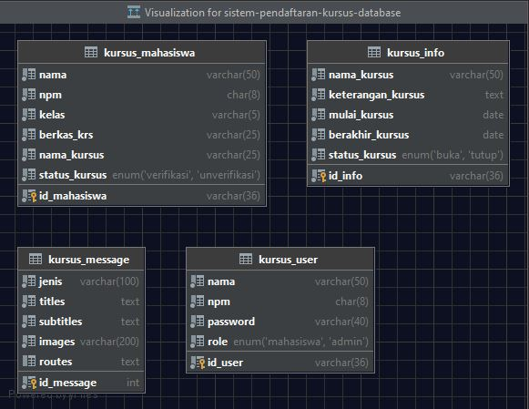
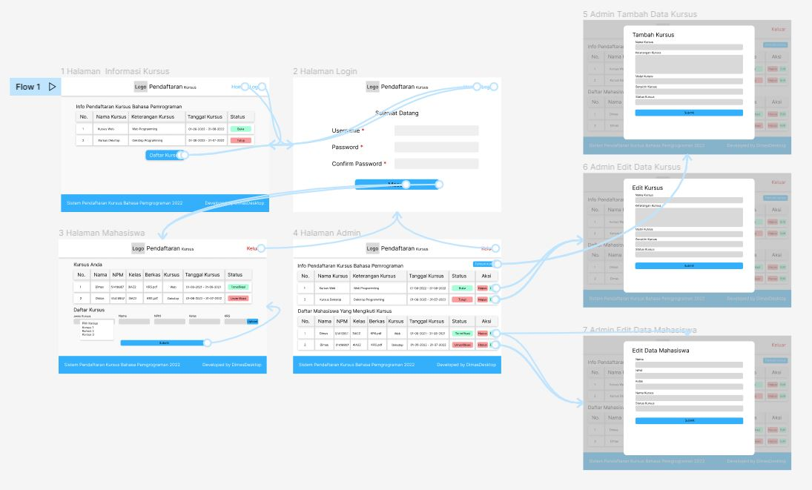

# Aplikasi Sistem Pendaftaran Kursus Bahasa Pemrograman

### Content
#### [Flowchart](Struktur%20Navigasi.png) [User Interface](User%20Interface) [Prototype](Prototype.jpg) [Database](database/database.jpg) [Figma](https://www.figma.com/file/xTFqMUT9JIoBZEI5bEp8jh/Sistem-Pendaftaran-Kursus-Bahasa-Pemrograman?node-id=0%3A1)

### Preview

### Database Structure

### Flowchart

### Prototype

